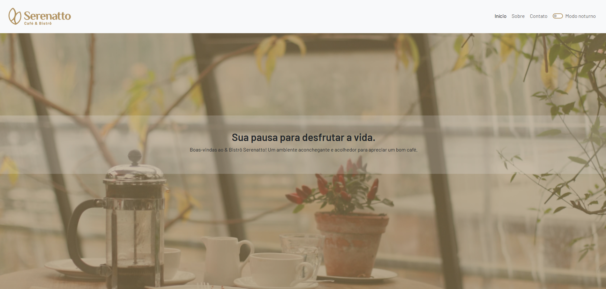
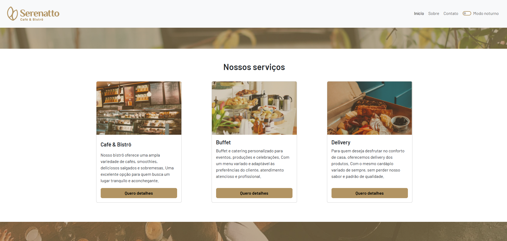
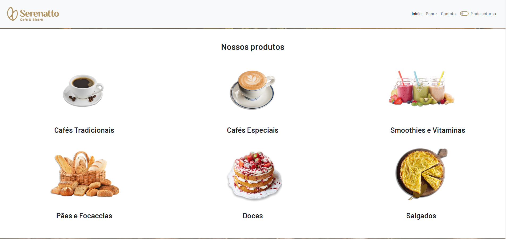
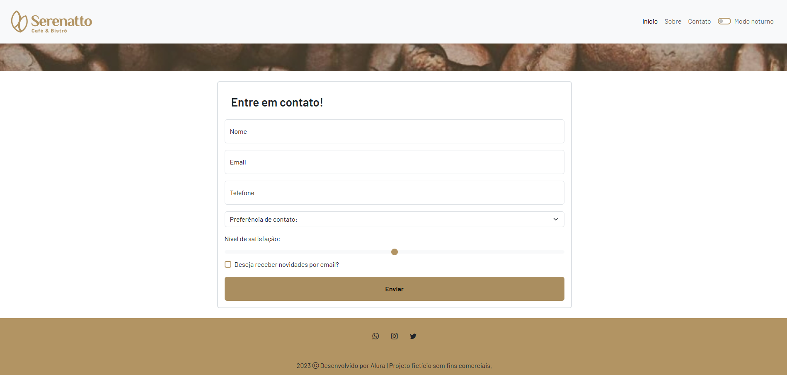

# Serenatto

Welcome to Serenatto, a responsive and elegant website developed to represent a fictional coffee shop and bistro. This project showcases modern web development techniques using **HTML**, **CSS**, **JavaScript**, and **Bootstrap 5**. It was created as part of a course on **Bootstrap 5** from Alura, focusing on responsiveness, usability, and user experience.

---

## 🌟 Features

### 🌐 Responsiveness
- **Grid System:** The website employs the Bootstrap grid system to ensure proper layout and spacing across devices.
- **Breakpoints:** Components adapt seamlessly to different screen sizes, offering an optimal experience on mobile, tablet, and desktop.

### 🎨 Modern Design
- **Parallax Effect:** Eye-catching banners with a parallax scrolling effect.
- **Custom Colors:** Unique color palette with shades of beige and brown for a cozy and welcoming look.
- **Dark Mode:** Toggle between light and dark themes, with smooth transitions.

### 🛠️ Interactive Components
- **Offcanvas Menu:** A collapsible navigation menu for better usability on mobile.
- **Accordion:** Organized information in a collapsible format for clarity.
- **Modals:** Detailed product descriptions presented in modal windows.
- **Cards:** Visually appealing cards with product previews and actions.
- **Form Elements:** An intuitive contact form with floating labels, range sliders, and input validation.

---

## 📖 What I Learned

This project allowed me to explore and apply the following skills and concepts:

### Bootstrap 5
- Working with the **grid system** to create responsive layouts.
- Using **breakpoints** to optimize the website for different devices.
- Customizing **inputs**, **cards**, and other components.
- Implementing advanced features like **offcanvas navigation**, **modals**, and **accordions**.
- Styling and toggling between **light** and **dark modes** using JavaScript and Bootstrap utilities.

### HTML & CSS
- Writing semantic HTML for better accessibility and SEO.
- Creating a **parallax effect** with CSS for a modern look.
- Customizing styles using CSS variables for consistent theming.

### JavaScript
- Manipulating DOM elements for theme toggling.
- Adding interactivity to Bootstrap components, such as modals and accordions.

---

## 📂 Project Structure

```plaintext
serenatto/
├── index.html        # Main HTML file
├── estilos.css       # Custom CSS for styling
├── script.js         # JavaScript for interactivity
├── assets/           # Images and other static assets
└── README.md         # Project documentation
```

---

## 🚀 How to Run

### Locally:
1. Clone this repository:
   ```bash
   git clone https://github.com/your-username/serenatto.git
   ```
2. Open `index.html` in your browser.

### Online:
If hosted, simply visit the live website link (replace with your hosting URL).

---

## 📷 Screenshots

### Home Page


### Services Section


### Products Section


### Contact Form


---

## 🛠️ Tools and Technologies
- **HTML5**
- **CSS3**
- **JavaScript (ES6)**
- **Bootstrap 5.3**
- **Google Fonts**

---

## 🧑‍💻 About the Course
This project was developed as part of the **"Bootstrap 5: New Features and Best Practices"** course from Alura. The course objectives were:

- Learning to create responsive and attractive websites with Bootstrap.
- Developing essential skills for web development.
- Mastering design techniques for usability and user experience.

Key topics covered:
- Bootstrap Documentation
- Inputs and Breakpoints
- Parallax Effects
- Offcanvas, Accordion, and Modal Components
- Form Design and Semantic HTML
- Light/Dark Mode with Custom Themes

---

## 🌟 Future Enhancements
- Add a working backend for form submissions.
- Include animations using JavaScript or CSS for a more dynamic experience.
- Optimize images and assets for faster loading.

---

## 🤝 Contributing
Feel free to fork this repository, create new features, or improve existing ones. Pull requests are welcome!

---

## 📜 License
This project is for educational purposes and does not have a specific license. Please use it responsibly.

---

## 📬 Contact
For questions or suggestions, reach out via GitHub or email.

